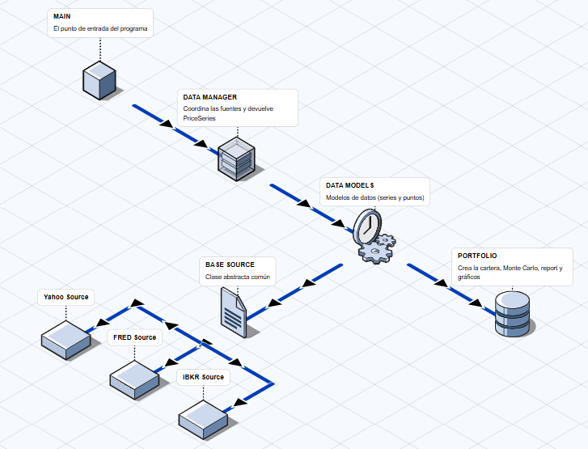

# 📊 Práctica 1 — Extractor y Análisis de Datos Bursátiles
Por Alonso Díaz Tapia 
Master en IA aplicada a los mercados financieros 
Noviembre 2025

## 🧭 Descripción general

Este proyecto implementa un **programa modular en Python** capaz de **extraer, estandarizar y analizar información bursátil** desde distintas fuentes de datos online.  
Además, permite construir una **cartera de inversión simulada** y realizar una **simulación Monte Carlo** para estimar su evolución futura.

El objetivo es aplicar **buenas prácticas de programación y diseño modular**, utilizando clases, herencia, dependencias claras y un formato de datos unificado.

## 🧩 Diagrama de arquitectura
La siguiente imagen muestra la estructura general del proyecto, incluyendo herencias y dependencias entre clases:



---

## ⚙️ Instalación

1. Clona el repositorio:
   ```bash
   git clone https://github.com/usuario/Practica-1.git
   cd Practica-1
   pip install -r requirements.txt
   python main.py

## Fuentes de datos utilizadas

- Yahoo Finance: datos reales de acciones e índices.
- FRED (Federal Reserve Economic Data): datos macroeconómicos.
- Interactive Brokers (IBKR): datos simulados, útiles para pruebas.

Cada fuente entrega datos en un formato distinto, pero el sistema los transforma automáticamente en objetos PriceSeries, garantizando la estandarización del formato.

## Construcción de la cartera

Las carteras se construyen a partir de N series de precios descargadas simultáneamente desde las fuentes.
Cada activo se representa con un objeto PriceSeries, y la cartera (Portfolio) almacena un conjunto de ellas junto con sus pesos normalizados

## Simulación de Monte Carlo

El método Monte Carlo se utiliza para estimar posibles trayectorias futuras de los precios o del valor total de la cartera.

A nivel de activo:
PriceSeries.monte_carlo(days, n_paths, initial_price)
A nivel de cartera:
Portfolio.monte_carlo(days, n_paths, initial_value)

Los resultados permiten obtener escenarios pesimista, medio y optimista (p5, p50, p95) para el valor de la cartera a un horizonte definido por el usuario.

## Informe y visualizaciones
Método .report()
Genera un informe en formato Markdown con:
- Composición de la cartera (activos y pesos)
- Rentabilidad media y volatilidad diaria
- Resultados del Monte Carlo (p5, p50, p95)
- Advertencias si los datos son insuficientes
Método .plots_report()
Genera un gráfico de la simulación Monte Carlo, mostrando:
- Varias trayectorias simuladas
- Trayectoria media de la cartera
